# 🌱 Nông Sản Shop

## 📌 Giới thiệu dự án

**Nông Sản Shop** là hệ thống website thương mại điện tử chuyên bán nông sản trực tuyến, hỗ trợ đầy đủ quy trình mua sắm dành cho khách hàng và quản trị viên.

Dự án được xây dựng theo mô hình **Fullstack tách Frontend và Backend**, sử dụng:

- **Spring Boot** xây dựng RESTful API Backend
- **Angular** phát triển giao diện người dùng và trang quản trị
- **MySQL** lưu trữ dữ liệu
- **JWT Security** cho xác thực và phân quyền
- **VNPAY Sandbox** cho thanh toán online
- **WebSocket** cho realtime notification

Hệ thống hỗ trợ đầy đủ các chức năng:

- Đăng ký / Đăng nhập / JWT Authentication
- Quản lý sản phẩm
- Danh mục sản phẩm
- Giỏ hàng
- Đặt hàng
- Thanh toán online qua VNPAY
- Quản lý đơn hàng
- Quản lý vận chuyển
- Yêu thích sản phẩm
- Đánh giá sản phẩm
- Gửi email thông báo
- Realtime notification bằng WebSocket
- Dashboard quản trị Admin

---

# 🛠️ Công nghệ sử dụng

## 🔙 Backend

- Java
- Spring Boot
- Spring Security
- JWT Authentication
- Spring Data JPA
- Hibernate
- Maven
- WebSocket
- Java Mail Sender

---

## 🎨 Frontend

- Angular
- TypeScript
- Bootstrap

---

## 🗄️ Database

- MySQL

---

# 🚀 Chức năng chính

## 👤 Người dùng

### 🔐 Authentication

- Đăng ký tài khoản
- Đăng nhập
- JWT Authentication
- Quên mật khẩu
- Gửi email xác thực

---

### 🛒 Mua sắm

- Xem, tìm kiếm và lọc sản phẩm
- Quản lý giỏ hàng và đặt hàng
- Thanh toán COD / VNPAY
- Theo dõi đơn hàng

---

### ⭐ Tương tác

- Đánh giá sản phẩm
- Nhận thông báo realtime
- Nhận email xác nhận đơn hàng

---

## 👨💼 Admin

### ⚙️ Quản lý hệ thống

- Dashboard thống kê
- Quản lý sản phẩm
- Quản lý danh mục
- Quản lý đơn hàng
- Quản lý đánh giá sản phẩm

---

# 🗄️ Thiết kế cơ sở dữ liệu

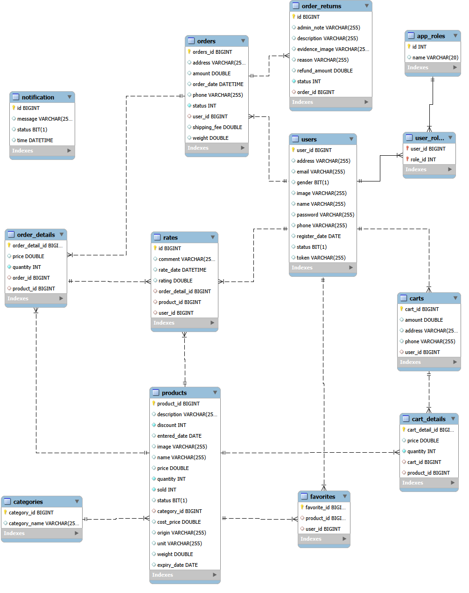

---


# ⚙️ Cách chạy dự án

## 1️⃣ Clone project

```bash
git clone https://github.com/tongquangtrung/DOAN
cd DOAN
```

---

## 2️⃣ Chạy Backend

### Di chuyển vào thư mục backend

```bash
cd shop-backend
```

### Cấu hình database

Chỉnh sửa file:

```bash
src/main/resources/application.properties
```

### Tạo database MySQL

```sql
CREATE DATABASE nongsan;
```

### Run project

```bash
mvn clean install
mvn spring-boot:run
```

### Backend chạy tại

```bash
http://localhost:8080
```

---

## 3️⃣ Chạy Frontend User

```bash
cd client-shop
npm start
```


---

## 4️⃣ Chạy Frontend Admin

```bash
cd client-admin
npm start
```

---

# 🖼️ Demo giao diện

## 👤 Trang khách hàng

- 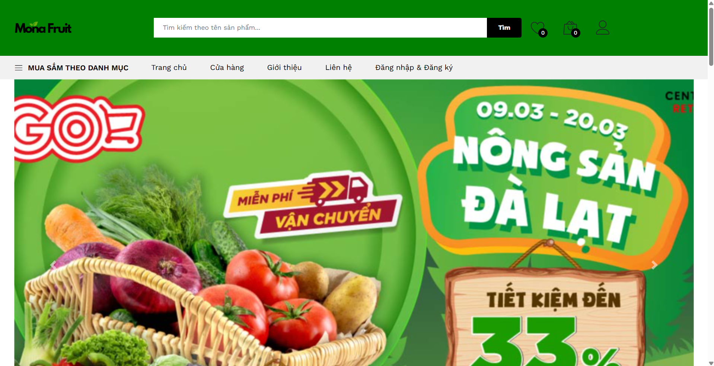
- 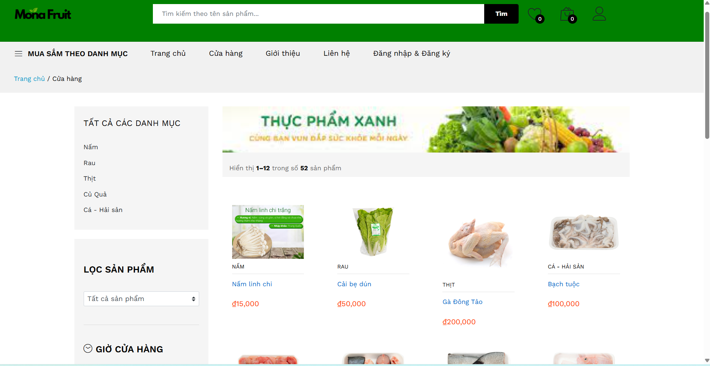
- 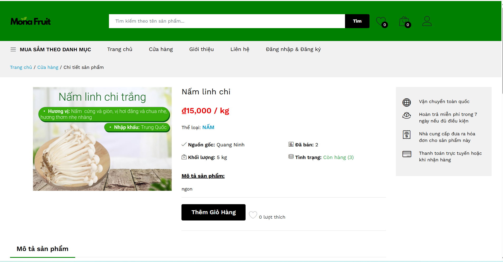
- 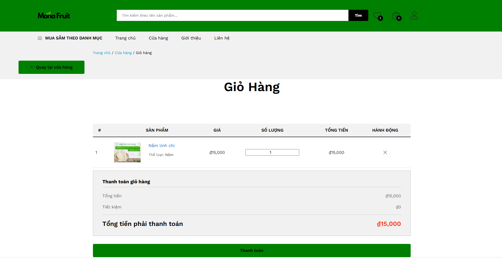
- 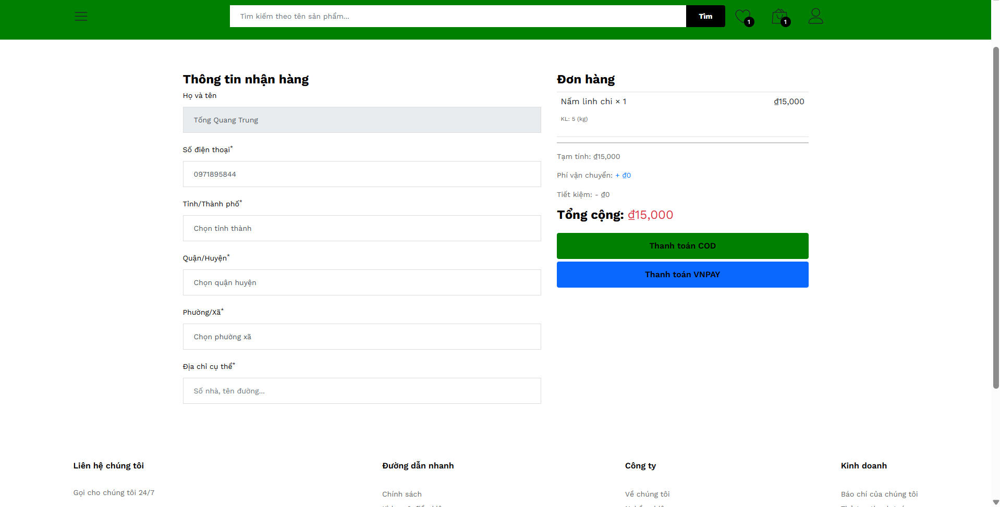
- 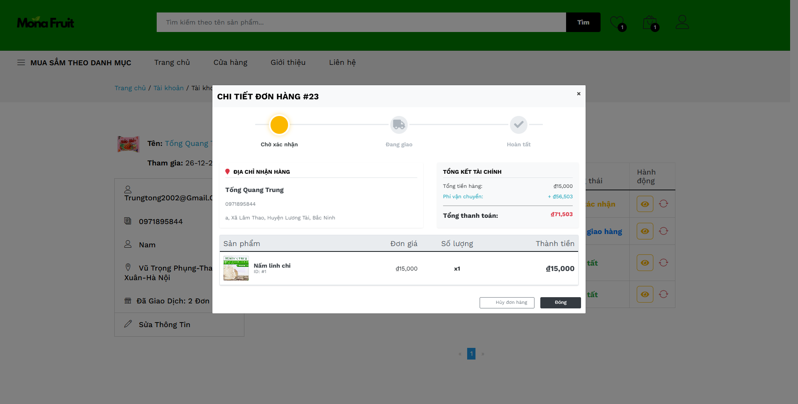

---

## 👨💼 Trang Admin

- 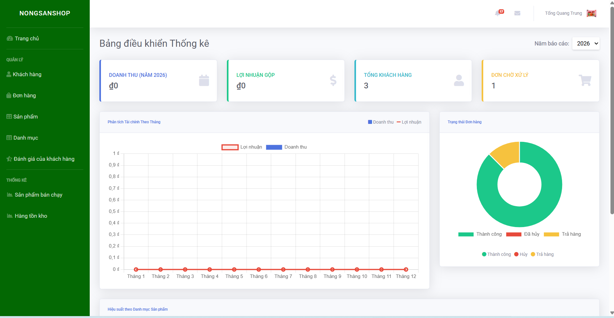
- 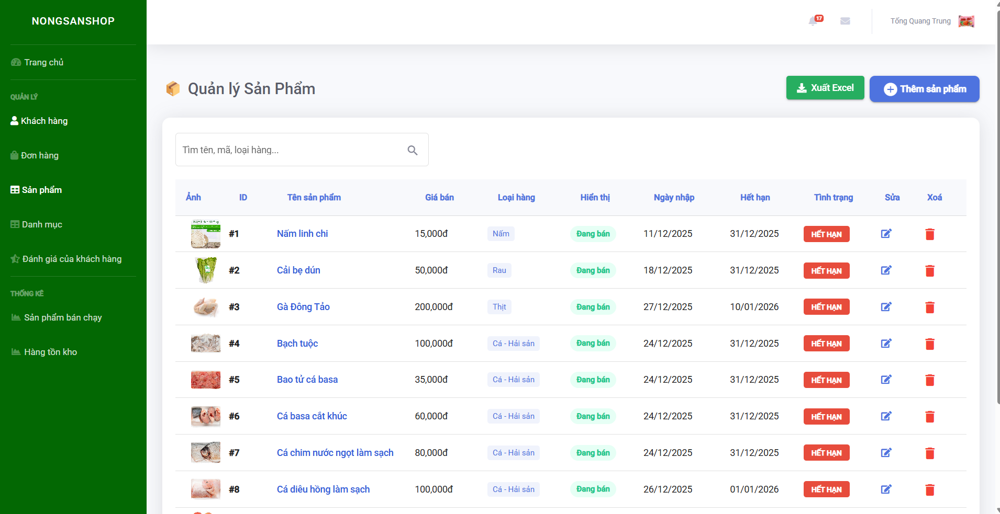
- 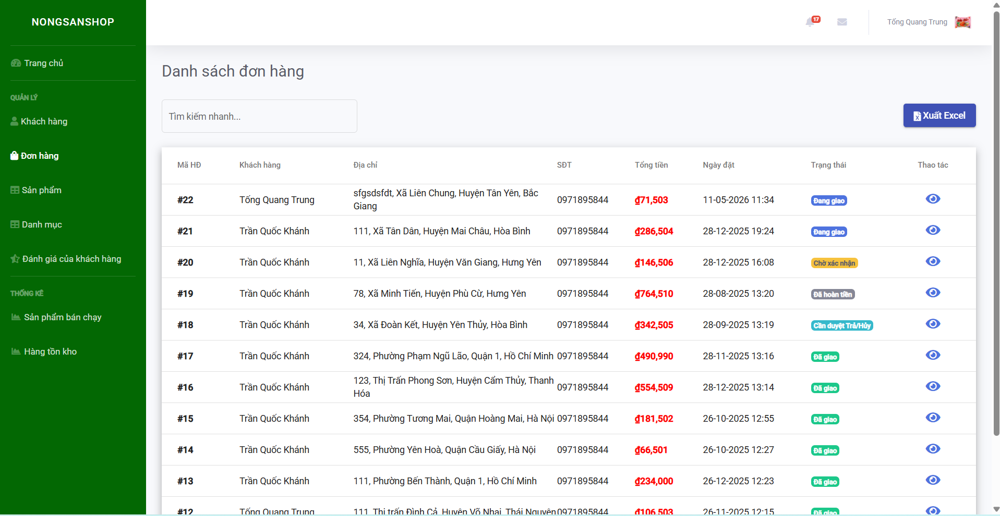
- 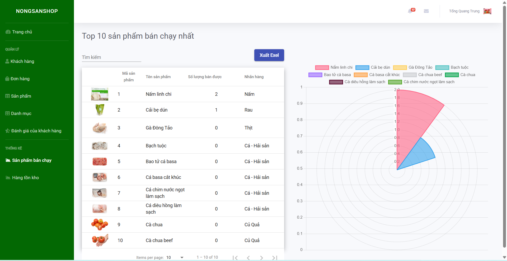

---


# ⭐ Ghi chú

Dự án được xây dựng phục vụ cho: 
- Đồ án tốt nghiệp
- Học tập và nghiên cứu
- Portfolio xin việc Fresher / Intern Java Backend

# 👨‍💻 Tác giả

## Tong Quang Trung - Vu Hai Anh - Tran Quoc Khanh


